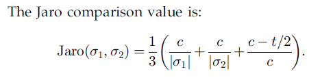
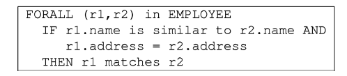

# Duplicate Record Detection: A Survey
发表期刊：TKDE 发表时间：2007 类别：实体解析综述
### 摘要
* 实体解析任务是去识别多个重复实体
* 难点包括两方面
	1. 不共享公共属性值
	2. 包含错误
		* 错误包括：抄写错误、不完整信息、缺乏标准格式、或者他们的综合
* 文章主要内容
	* 提出了字符串相似度量方法
	* 记录去重算法
	* 提高效率和可扩展性
### 1. 引言
	* 数据质量问题包括
		* 数据输入错误：microsoft->microsft
		* 违反完整性约束：age=375
		* 记录信息的不同格式：44 W.4th->44 West Fourth street
	* 当集成来自不同数据源的数据时，会遇到数据异质问题
		* structural heterogeneity
			* 来自不同数据源的数据组织结构不同
			* example:
				* DB1:address
				* DB2:street,city,state and zipcode
		* lexical heterogeneity
			* 不同数据源的数据组织结构相同，但是其数据的表达形式不同
			* example
				* DS1:StreetAdress=44 W.4th St.
				* DS2:StreetAdress=44 West Fourth Street 
	* 文章的组织形式
		* 章节2：描述在数据去重之前的数据处理清洗操作
		* 章节3：描述匹配技术在单独的域上
		* 章节4：提出技术来做记录匹配在多个域上
		* 章节5：提出了方法来提高去重效率问题
		* 章节6：提出了工具当前商业、工业使用的用来做实体解析与评估的工具
		* 章节7：总结
### 2. 数据准备
	* 在对数据去重之前，需要有一个数据准备阶段，在这个阶段，需要将数据以同一的格式存储到数据库中，解决结构异质的问题
	* 数据准备阶段包括：语法解析，数据转换和标准化步骤
	* 数据准备阶段可以提高数据输入的质量，使得数据之间具有可比较性和实用性，具体可使用ETL工具（extraction,transformation,loading）
	* 数据转换论文：IEEE Data Eng. Bull., E. Rundensteiner, ed., special issue on date transformation, vol. 22, no. 1, Jan. 1999.
	* 数据准备
		* 语法分析
			* 解析定位、标识和隔离源文件中的各个数据元素
		* 数据转换
			1. 名称转换
			2. 范围检查 数值 日期
			3. 依赖检查；保证数据的一致性
		* 数据标准化
			* 地址名称标准化
				* 房子号码，街道名字，邮箱、公寓号码，乡村道路
			* 日期和时间标准化
			* 名称标准化
				* first name,last name,标题，首字母等等
	* 经过数据准备阶段，数据就变得可比较了，下一步就是识别哪些域可以做对比
	* 数据准备阶段：语法分析，数据标准化，识别相似域
### 3. 匹配技术在某一域上
* 印刷错误是最常见的错误，重复检测通常依赖于字符串比较技术去处理印刷错误问题
* 3.1 Character-Based Similarity Metrics
	* edit distance
	* affine gap distance
	* Smith-waterman distance
	* Jaro distance metric
	* Q-gram distance
	* 3.1.1 编辑距离（Levenshtein distance）
		* 计算经过插入、删除、替换最少操作从一个字符串转换为另一个字符串
	* 3.1.2 Affine Gap Distance
		* 仿射变换适用于字符串被缩短，缩写的形式
		* example:(e.g., “John R. Smith” versus “Jonathan Richard Smith”
	* 3.1.3 Smith-Waterman Distance
		* 这种方法是编辑距离和仿射变换的扩展，描述了编辑距离和仿射距离的扩展，其中字符串开头和结尾不匹配的代价低于中间不匹配的代价
		* 允许对字符串进行更好的局部对齐
		* example:“Prof. John R. Smith, University of Calgary” and “John R. Smith, Prof.”
	* 3.1.4 Jaro Distance Metric
		* Jaro[39]引入了一种字符串比较算法，主要用于姓氏和姓氏的比较
		* 三个步骤计算：
			1. 计算字符串长度len1和len2
			2. 发现“common characters”,满足一定的条件
			3. 计算移项t
			4. 计算公式如下：
			* 
	* 3.1.5 Q-Grams
		* 使用q-g作为近似字符串匹配的基础的直觉是，当两个字符串1和2相似时，它们共享大量的q-g	
		* trigrams, bigrams, unigrams
* 3.2 Token-Based Similarity Metrics
	* character-based相似性度量在印刷错误方面表现很好，但是对于单词的重新排列问题无法解决
	* 3.2.1 Atomic Strings
		* 两个原子字符串匹配因为他们相等或者一个是另一个的前缀
	* 3.2.2 WHIRL(旋转)
		* 应用cosine相似性与tfidf权重结合来计算相似性，word作为基本单位
	* 3.2.3 Q-Grams with tf.idf
		* WHIRL的扩展，基本单位是q-gram 字符
* 3.3 语音相似性
* 3.4 数字相似性度量
	* 研究的比较少，可以当做字符处理，或者简单的范围查找，考虑数字的分布或类型
### 4. DETECTING DUPLICATE RECORDS
* 对于多个域的记录匹配，常用的方法主要分为俩类
	* 依赖于训练数据去学习如何匹配记录，包括概率统计方法与监督式机器学习方法
	* 依赖于领域知识或者常用距离度量来匹配，包括使用宣称式语言或者设计距离度量方法
* 4.1 符号
	* 这节是对元组对的表示方法：
	* tuple pair<a,b>
	* 随机向量 x=[x1,x2,...,xn]
	* n表示有n个可以比较的域
	* xi代表第ith个域对于记录a,b
	* xi=1 表示满足条件
	* xi=0 表示不满足条件
* 4.2 概率匹配模型
	* 将实体解析看做贝叶斯推理问题
	* 主要假设是x表示一个随机向量，它的密度函数在两类中不同（match or nonmatch）
	* 4.2.1 The Bayes Decision Rule for Minimum Error
	* 4.2.2 The Bayes Decision Rule for Minimum Cost
* 4.4 主动学习
	* 主动学习提除了“模糊区域”
	* 有些样本区分度较高，可以直接标记为M或者U
	* 对于有些样本区分度不高，需要作为“模糊区域”返回给专家做标记
	* 具体的步骤：
		* 首先利用一少部分标记数据作为初始训练数据训练分类器
		* 利用分类器对新样本中未标记的样本进行标记
		* 区分度比较高就直接标记，区分度比较低，当做模糊区域对待，然后送往专家重新标记
* 4.5 基于距离的技术
	* 定义距离度量方法与适当的阈值可以对记录对进行判断其是否匹配
	* 比较典型的就是使用tfidf计算单词权重，并使用cosine距离计算元组对之间的相似性
	* 可以使用字符相似性，同时使用单词外键共现关系
	* 例如：
		* “CA” and “California” 
		* have small textual similarity
		* the city entries “San Francisco,” “Los Angeles,” “San Diego,” and so on, often have foreign keys that point both to “CA” and “California.”
		* 另外一个问题是阈值的选择
* 4.6 基于规则的技术
	* 宣称式语言来指定规则
	* 例如：
	* 
	* 系统如：AJAX 利用宣称式语言去定义规则来进行匹配
* 4.7 无监督方法
	* 主要是利用聚类技术来区分（匹配、不匹配或者可能匹配）
### 5. 提高实体解析的效率
* 实体解析两个挑战
	1. 质量  如何精确判断两个元组是否匹配
	2. 效率  如何快速的进行匹配
* 这个章节主要是研究如何去减少不必要的匹配，节约成本开销
* 5.1 减少记录匹配数量
	* 5.1.1 Blocking 分块方法
		* 传统的方法，扫描整个表，然后利用哈希函数将相同的实体映射到同一个桶中，然后在每个桶中取计算是否匹配
		* 缺点是：不同保证相似记录的散列值是相同的
		* 分块：
			* 分块技术通常指的是将一个文件划分为一些互斥的子集（块），这些块之间不存在匹配的元组
			* 实现，利用分块函数在高区分的字段上
	* 5.1.2 sorted neighborhood 排序近邻方法
		* 这个方法分为三部分
			* create key  提取相关的字段或者字段中的部分
			* sort data 根据第一步提取的关键字key进行排序，key是来自某个属性，或者属性的一部分，前边出现的属性优先级要高于后面出现的属性
			* merge 设置一个滑动窗口大小w,则w中每个记录与其余w-1个记录进行比较
		* 基本假设
			* 排序近邻方法依赖于基本假设：重复记录在排序近邻表中是相近的
			* 结果严重依赖于排序key，如果key值发生错误，则不可能发现所有的匹配对
		* 相对改进的方法
			* 使用多个不同key进行排序，然后使用较小的窗口大小进行比较
	* 5.1.3 Clustering and Canopies
		* 基本的假设：
			* 重复发现是可传递的，a=b,b=c==>a=c
		* 基于这个假设，问题可以描述称为在一个无向图中寻找连通分支
		* union-find方法：
			* 在union阶段，重复记录被聚类到一个类中，然后选出一个类中代表作为后续使用
			* 减少了匹配的数量，但是准确率并没有下降
		* canopies方法
			* 为了加速重复检测过程
			* 基本的思想是：
				* 第一步：使用廉价的距离度量方法将记录分组到**有重叠**的类中，这个类被称作canopies
				* 第二部：使用昂贵的度量方法来进行成对比较
			* 相对应的blocking是没有重叠的
			* 优点：可以使用“quick and dirty”廉价方法对数据进行快速聚类
			* 举例：如果两个字符串s1与s2的长度差别3，则他们的编辑距离不可能小于3
		* canopy方法实例 
			* tf-idf
				* tf-idf作为canopy距离度量
				* 然后使用多个昂贵的方法度量两个记录，判断他们是否相似
			* the string lenth and the number of common q-gram of two strings
				* 字符串长度与q-gram数量作为canopy度量
				* 编辑距离作为昂贵的方法，判断两条记录是否相似
			* indexable canopy function
				* 容易识别相似元组在一个关系数据库中
			* 有一篇论文专门实验验证各种canopy方法，canopy方法可以显著的提高实体解析的质量与效率
				* 【97】
	* 5.1.4 Set Joins
		* 集合连接也是提高匹配效率的一种方式
		* 集合计算更感兴趣的是那些字符串相似性比较高的匹配对，多以很多算法与研究都是基于这个性质来快速计算基于集合的操作
			*  in-memory inverted indexes together with an A* search algorithm to locate the top-k most similar pairs, according to the cosine similarity metric.
			* 剪枝倒排索引，去除掉那些权重比较低的项，那些对计算tf-idf cosine距离没有用的
* 5.2 Improving the Efficiency of Record Comparison
	* 这部分的主要内容是使用某些一部分特征做匹配，避免了使用不必要的特征比较，提高了比较的效率
### 6. DUPLICATE DETECTION TOOLS
* 这章主要是讲解目前可用的实体解析工具
	* The Febrl system
		* 第一部分数据标准化 HMM
		* 第二部分执行精确的重复记录匹配方法 字符串相似性度量方法 jaro,edit distance,q-gram距离
	* TAILOR
		* 利用分层的策略来进行设计匹配方法
	* WHIRL
		* 一个重复记录检测系统免费用作学术研究
		* 使用tfidf token based 方法来计算相似度
	* BigMatch
		* 重复检测项目来源于美国人口统计局
### 7. FUTURE DIRECTIONS AND CONCLUSIONS
* 对于实体解析问题
	* 缺乏可信赖的数据供做研究，尤其是对于学习型算法缺乏标记数据
	* 算法的可扩展性和健壮性值得进一步的关注
	* 除了结构化数据，文本形式的非结构化数据更为复杂
	* 信息提取技术将会广泛的利用在实体解析任务中