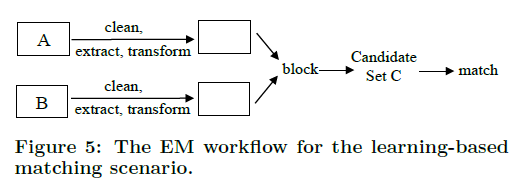

# Magellan:Toward Building Entity Matching Management Systems
发表时间：2016  发表期刊：VLDB 作者：威斯康星麦迪逊分校14位作者
### 摘要
	* 不同于以前的研究关注（发展匹配算法），Mallegen目标是建立一个完整的EM系统
	* Magellan突出表现在四个方面：
		1. 提供了操作指南，引导使用者在每个EM场景中如何一步一步操作
		2. 提供了工具帮助用户做这些步骤，这些操作覆盖整个Pipeline,而不仅仅是分块或者匹配
		3. 工具基于python用于数据分析和大数据栈
		4. 提供了丰富的脚本环境来帮助执行交互实验或者快速修补系统
### 1. 引言
	* 之前的研究存在四个局限性，导致不能够在实际中广泛的使用
		1. 执行EM过程通常需要执行多个步骤
			* 分块 匹配 探索 清洗 排错 采样 标记 评估准确率
			* 当前的系统不包括整个的EM的pipeline,而是只支持很少的步骤（分块，匹配）而忽视了很重要的步骤（排错，采样）
		2. EM步骤经常需要开发多种技术
			* 学习 挖掘 可视化 离群点发现 信息抽取（IE） 众包
			* 将这些技术融入一个系统是很难的，所以当前的系统都是独立的整体，不能够从头到尾的执行EM系统，而且不能够和其它系统很好的合作
		3. 用户通常需要写代码来修补系统
			* 像去执行一个缺失功能的系统或者将多个系统融合在一起
			* 理想的情况是需要使用脚本语言在交互环境中，使得能够快速的预输入和迭代
		4. 用户不知道如何去根据不同的EM场景去选择不同的方法
			* 基于规则的方法 基于学习型的方法（决策树 SVM等等）或者众包的方法
	* The Magellan(麦哲伦)
		* 这是威斯康星麦迪逊分校与沃尔玛实验室合作的项目，命名来源于（费迪南麦哲伦，葡萄牙航海家）
		* Magellan的介绍：
			* Magellan提供指南告诉用户在不同的EM场景下如何去做，一步一步
			* Magellan还提供的每一步执行的工具，这些工具覆盖真个pipeline,包括分块，匹配，抽样或者排错
			* 这些工具都是基于python数据分析与大数据栈
				* 对于EM场景，提供给用户的包括两个阶段
					1. 开发阶段，使用数据样本进行数据分析，选择精确的EM工作流程，提供pandas,scikit-learn,matplotlib等等
					2. 生产阶段，使用完整的数据执行整个工作流程，提供pydoop,mrjob,pyspark等等
			* Magellan位于一个强大的交互式脚本环境，用户可以用来修补系统
		* 挑战
			1. 如何开发指南帮助用户选择EM的pipeline
			2. 如何开发有效的工具支持用户执行EM流程，像加载数据、抽样、标记以及排错等匹配或者分块
			3. 如何设计Mallegen使他成为一个生态能够与其它系统很好的合作
		* 文章的贡献
			* 提出了对EM领域的进一步的努力应该是取建立EM系统，推动领域的发展
			* 讨论了四个限制，阻碍了EM系统的广泛使用
			* 描述了Magellan系统，在几个重要的方面：如何去指南，工具支持EM的pipeline,与Python数据生态紧密集成，容易使用交互式脚本环境
			* 描述了实现Magellan的重要挑战，包括设计开放的系统
			* 进行了广泛的实验
### 2. 实体匹配管理系统的情况
	* 目前系统存在的问题
		* 系统不覆盖整个的EM的pipeline(分块，匹配，抽样，标记，排错，信息抽取，探索，清洗)
		* 很难利用广泛的技术（学习，挖掘，可视化，数据清洗，IE,SQL查询，众包，关键字查找）
			* 例如，用户想清洗属性值，提取商标姓名或者建立直方图对于价格，选择匹配方法：学习型，众包或者其他统计技术
		* 很难写代码去修补系统
			* 应该提供脚本环境
		* 很少的指导用户去如何匹配
	* EM系统的设计应该符号一下几点
		* 详细的操作指南
		* 丰富的工具
		* 节省时间
		* 可扩展性强
### 3. Magellan方法
	* 提供给用户的解决步骤分为两步：开发阶段和生产阶段
	* EM场景
		1. Problems:双表匹配、单表匹配，或者表与知识库的匹配
		2. Solutions:学习型的；基于学习和规则的；执行数据清洗，然后分块，再匹配；先信息抽取，再清洗，然后分块，最后再匹配；
		3. Domains:医疗数据，电子商务数据，引用数据等等
		4. Performance:精确率与召回率的标准
		* 举例：matching two tables of e-commerce products using a rule-based approach with desired precision of at least 95%.
	* EM工作流程
		* 清洗 信息提取 分块 匹配 排错等等
	* 开发阶段
		* 数据抽样选择合适的工作流程，保证精度
	* 生产阶段
		* 在整个数据集上执行EM处理流程，保证可扩展性
### 4. 如何去指导和工具
	* 4.1 加载和采样表格
		* 对于数据表格A和B，首先需要去采样得到子表格
		* 子表格的选择方法
			* c1: down_sample_tables (A, B, B_size, k)
			* 在B中随机选择B_size大小的的元组组成B'
			* 然后在A中为每个B'中元组选择大小为k/2的元组，符合匹配原则（共享大量的数据）,作为P
			* 然后在A中随机选择Q个元组
			* P与Q共同组成A'
		* 更加详细的采样方法
			* 采用聚类的思想对A与B进行聚类，然后用于去推断匹配策略
	* 4.2 分块去创建候选元组对
		1. 已经知道分类器
			* 使用分类器去推断有效的分块策略
		2. 不知道分类器时候，但是有标记样本
			* 使用标记样本（匹配/不匹配）去学习一个分块器（blocker）例如随机森林
		3. 既没有分类器，有没有标记样本
			* 三个问题：
				* 如何选择好的blocker
					1. 可以手动标记一些数据，然后情况类似于case2
					2. 使用领域知识，采用某一属性作为分块的依据
					3. 其它的分块策略
						1. 覆盖（overlap）
						2. 属性相等（AE）
						3. 排序近邻（SNB）
						4. 基于hash
						5. 基于规则
						* 实例
							* 用户可以首先使用overlap分块策略
								* 匹配元组如果他们共享至少k个tokens
							* 然后使用AE(属性相等)
								* 匹配的元组必须共享相同的值对于某一个属性
							* 之后，可以使用SNB（排序近邻）,hash
							* 最后，可以使用基于规则的方法
							* 还可以使用主动学习来提供用户去标记数据
							* 总之，可以使用他们的组合来获得高质量的分块
				* 如何去debug一个给定的blocker
					* 应用L在A'与B'之上，然后产生C个可能的匹配对
					* D是A'XB'/C，在D中选择K个可能的匹配对，k=200默认
					* 然后用户去检测D，如果匹配的太多，说明blocker效果不好，需要重新去做blocker修改
				* 如何知道什么时候停止修改blocker
					* 用户希望分块做到
						* 强剪枝能力：最大化1-|block(L,A',B')|/|A'XB'|
						* 高召回率：匹配的元组被分到一个块中
					* 利用dubugger来来计算，利用blocker L移除的部分，匹配的元组越少或者没有，则可以停止分块了
				
		
	* 4.3 采样和标记元组对
		* 对于blocker L,应用L到A'与B'上，产生候选的C
		* C中抽样，然后标记S中的匹配对为匹配或者不匹配
		* 利用这些标记的样本去训练分类器
		* 采样策略
			* 分块的结果，可能出现C中匹配的元组对太少，可能是由于分块太随机
			* 所以如何去评估分块的优劣，可以采用随机采样的方法
				* 首先从C中选择一小部分样本S1
				* 标记这些元组对
				* 如果匹配的样本较多，则密集型的分块，可以使用
				* 否则，需要重做分块步骤
	* 4.4 选择一个分类器
		* 一旦用户获得了标记样本集S,用户可是使用它来训练分类器
		* 分类器如决策树、朴素贝叶斯、或者SVM等等
		* 如何去选择一个好的分类器：
			* c3: get_features_for_matching (A, B)
			* c4: select_matcher (matchers, table, exclude_attrs, target_attr, k = 5)
			1. 首先去创建特征集合F=[f1,f2,f3...,fn]
			2. 每一个fi都是一个函数将A与B映射为一个值，例如计算jaccard值
			3. 利用F可以将元组对转换为一个特征向量
			4. 然后可以将这些向量表示的样本分割成训练集和验证集合两部分
			5. 利用这些样本去对matcher训练做交叉验证，选择结果好的分类器，或者解析性好的
	* 4.5 调试一个分类器
		* 对于选择的分类器，需要去调试，才能达到很好的效果，而这一步骤研究很少
		* 调试分类器分为三个步骤
			1. 识别并理解由x带来的匹配错误
				* 将开发集合I分为两个数据集P和Q,然后在P上训练分类器，在Q上做测试，Q是已知标签的样本
				* 用户U可以使用dubugger来解释为什么发生错误（例如决策树会显示从根节点到叶子节点的路径）
				* 错误类型
					* 数据可能是脏数据
					* 标记可能错误
					* 提取特征可能随时有问题的，有的特征有误导性或者缺乏某一新特征
					* 应用于X的学习算法可能是有问题的
				* 目前对于决策树和随机森林是有debugger的，其它的算法的debugger还在探索中
			2. 分类这些错误
				* 在用户测试所有或者大量的匹配错误之后，他们可以将这些问题进行分类
				* 错误来源于：数据，标记，特征，学习算法
			3. 处理常见的错误类别
				* 对于常见的错误类别：数据，标记，特征，学习算法，用户需要去做处理
			* 代理调试
				* 如果没有调试器，则使用代理调试
			* 重新选择分类器
				* 首先选择一个初始分类器X
				* debug X使用开发集合I
				* debug时候，将I划分成训练集合P和测试集合Q,然后识别和修补错误在Q上，可以划分多次
				* 当数据，标记，特征都可能发生改变时候，用户想要使用交叉验证方法再一次的选择一个新的分类器
	* 4.6 生成EM工作流
		* EM工作流,如下图所示，可以使用在生产阶段
	* 4.7 如何去指导利用规则的EM场景
		* Malegan目前支持三种EM场景
			1. 使用基于学习的
			2. 使用规则的
				* 帮助用户手动的创建创建匹配规则
				* 帮助用户使用标记数据创建匹配规则
				* 使用主动学习去创建匹配规则
			3. 学习型和规则相结合的

### 5. 设计EM为开放世界
	* 期望我们的系统Malegan可以跟其他的系统进行交互
	* 需要依赖其他系统去做学习，挖掘，可视化或者信息提取
	* 两个难题：数据结构与元数据
		* 数据结构
			* 使用pandas,应用malegen数据作为数据框架(choose)
			* MTable
			* MDate
		* 元数据
			
### 6. 经验评估
	* 首先，让44个学生应用Magellan在不同的EM场景中
	* 然后，将Magellan应用到机构中，得到结果报告
### 8. 总结
	* 本文目标是建立一个系统，包括整个的EM的pipeline
	* Magellan的功能
		* 提供给用户使用指南
		* 提供给用户工具，可以一步一步执行任务
		* 与python生态紧密集成
		* 提供了交互脚本环境
		
		
		
	