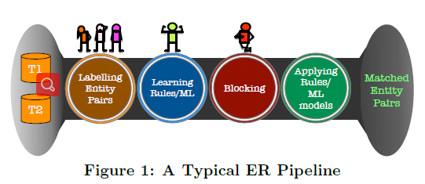
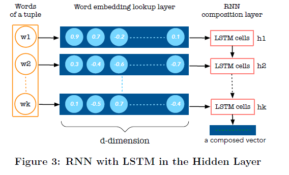
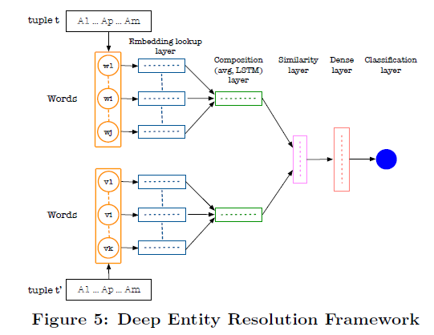

# Distributed Representations of Tuples for Entity Resolution
发表时间：2018
发表期刊：VLDB
### 摘要
* 目的：减少人工参与，例如标记数据、执行特征工程、调节参数、和定义分块函数
* DEEPER:准确性、执行效率和简单易用(accurate,efficient, and easy-to-use)
* 主要思想：将整个元组表示成分布式形式（向量表达），使用单向或双向的LSTM网络，然后利用向量计算元组之间的相似性
* 分块方法：提出了局部敏感哈希（LSH），与传统的利用部分属性的方法相比，此方法利用了元组中全部的属性信息，能够产生更小的块
* 大量的实验（基准数据，医疗数据以及多语言数据）证明了DEEPER的效果优于已存在的方法

### 1. 引言
* 实体解析是作为数据集成的基础问题，已经被研究超过70年时间
* 研究内容包括：宣称式规则定义，机器学习，众包形式
* 面向的领域：医疗、电子商务、数据仓库等
* 数据形式：大量，多样（不同来源）
* 一个典型的实体解析流程：
* 
* 实体解析过程包括四个步骤：
	1. 标记实体（匹配或者不匹配）   （需要先验知识）
	2. 使用标记样本去学习得到规则或者模型   （需要统一的标准或者阈值来判断是否匹配）（捕获语义与语法相似性而不需要特征工程和参数调节）
	3. 分块减少成对匹配的数量       （需要整体观体现在利用所有属性的信息）
	4. 在块中执行匹配规则或者模型
* (https://github.com/Simmetrics/simmetrics)有29中符号相似性比较方法
* 解决方法：元组的分布式表达
* wordembedding:word2vec与glove(840 billion tokens),fastText
* 具体贡献：DEEPER(accurate,efficient,easy-to-use)
	1. [Distributed representations of tuples for ER.] 
		* 使用简单的求和平均
		* 使用单向或双向的LSTM
	2. [Learning/tuning distributed representations.]
	3. [Blocking for distributed representations.]
		* 提出两种算法基于元组的分布式表达与局部敏感哈希
	4. [Experiments.]
### 2.元组的分布式表达对于实体解析任务
* wordembedding:
	* word2vec
	* glove
	* fastText
* 元组的分布式表达
	* 平均，每个属性中的值的向量做平均，然后对所有属性做串联
		* ID与数字不进行做向量化，直接以UNK对待
	* RNN with LSTM
		* average方法忽略了词序关系
		* 考虑词序关系，从glove中得到词向量，然后利用神经网络去组合这些向量
			* 尤其是像【标题】在【引用】数据集合中
			* 以及【描述】在【产品】数据集中
		* 组合技术来源于语言结构
			* n-gram
			* 序列
			* 树结构
		* 本文使用单向或双向的RNN,以及LSTM作为隐藏单元（LSTM-RNNS）作为组合网络
		
	* RNN的优势
		* rnn可以将一组单词序列编码为一个固定维度的向量
		* 最后时间步的输出状态代表整个元组的向量表示
		* LSTM单元包括特别设计的门为了存储，修改或者删除信息，能够使得rnn去学习长距离序列依赖
		* 单向rnn,从左到右学习，双向rnn将从左到右，从右到左进行串联拼接得到整个元组的向量表达
		* LSTM-RNN模型的参数需要去通过具体的ER任务在DL框架中学习得到
		* 属性少的情况下，属性的顺序不重要，但是属性多的情况下，需要将语义相关的属性彼此靠近
			* 需要去分析数据之间的依赖关系
			* 例如 country决定capital，那么这两个属性应该彼此靠近
	* Computing Distributional Similarity
		* 例如v(t1)=[0.45,0.23]|v(t2)=[0.42,0.28]
		* 对于向量平均方法
			* 应用cosine相似性在每个d维度（d维度代表一个属性，总共m个属性）
			* 产生的结果是一个m维的相似性向量
			* avg=[0.99,1.0]
		* 对于LSTM
			* 每个向量是x维度，代表一个元组
			* 应用减法（向量差）或者乘法（hadamard product）计算，
			* 产生的结果是x维度的相似性向量
			* lstm=[0.03,-0.05]
	* Classification Problem
		* ER任务通常会作为一个二元分类任务来对待，表示两个元组是否匹配
		* 通过上面等得到的相似性向量以及对应的标签，然后使用SVM,decision tree,random forests来训练分类器
### 3. 学习和调整分布式表达
* 上面的实验都是基于两个假设
	1. 存在预训练单词向量对于大多数单词在数据集中
	2. 预训练的单词向量被训练是以一种以任务不可知的方式训练

* 真是场景中，会发生三种情况
	* 通用数据可以达到全覆盖
		* 大部分数据集可以再预训练语料中找到其词向量
	* 通用数据达到部分覆盖
		* glove训练语料包含8400亿单词符号，其中有词汇量220万
		* 但是对于特定领域的一些专有名词，姓名或者机构名在语料中缺乏，而这些词又对于识别实体非常重要
		* 前边缺失的词以UNK对待，但是这些词可能会和ER任务十分相关
		* 对未出现的词的解决方法
			* 添加新的训练语料进行重新训练，代价太高
			* 另一个方法是选择单词共现的top-k个单词，然后用top-k个单词的平均值作为替代
			* 另一个方法是使用字符级别的嵌入方法例如fastText代替单词级别的嵌入或者使用子词的信息
		* 词汇翻新
			* 对于出现在词汇表里的单词，则直接取其向量表达
			* 对于未出现在词汇表里的单词，则取其top-k共现单词的向量的平均来表示
			* 对于top-k共现计算，可以自定义其无向图中边的含义，可以是同一属性内，或者同一元组
	* Specific Data with Minimal Coverage
		* 当ER数据集是基于特殊的领域信息时候
		* 数据集中包括不常用的单词，例如：P53与cancer是相关的
		* 对于大多数数据集中单词都没有在向量词汇表中发现时候，则词汇翻新则非常有用
		* 解决方法由以下三个方面组成：
			1. Unsupervised Representation from Datasets
				* 如果数据集中数据量特别大的时候，可以使用word2vec/glove从头开始训练
			2. Unsupervised Learning from related Corpus.
				* 可以从相关的文档中取学习单词向量的表达
			3. Customized Word Embeddings. 
				* 使用相关领域学习过得词向量表达
		* TuningWord Embeddings for an ER Task
			* 因为word2vec与glove都是以一种领域无关的方式训练的，那么训练出来的数据后可以使用领域的知识进行微调
	
	
### 4. 利用分布式表达进行分块
	* 分块技术级别介绍
		* 分块策略是为了减小搜索空间
		* 重复实体必须分到一个块中
		* 分块问题可以转换为在一个相似空间中近似最近邻（ANN）搜索问题
		* LSH是一个流行的概率技术用于在一个高维空间中寻找ANN
	* 分块技术的挑战
		* 定义好的分块规则——>需要领域专家的帮助
		* 分块技术通常考虑很少的属性（2-3)——>所以可能出现在某些属性上可以归为一类，但是在另一些属性上差距较大
		* 之前的相似性通常不包括元组之间的语义相似性
		* 通常很难去调节分块策略来控制召回率或者分块的块的大小
	* DRS与LSH的组合
		* 可以解放领域专家的时间
		* 问题转换为在一个高维相似空间中寻找元组
		* DRs编码了语义内容在元组中，LSH考虑整个元组的信息来做分块
	* LSH处理的流程
		* 例如 元组t1，t2中含有相同的属性v1
		* 设置k=1,L=1
		* v1(t1)=[0.45,0.8,0.85]  v1(t2)=[0.4,0.85,0.75]
		* hash functions(k个):
			* h1=[-1,1,1]
			* h2=[1,1,1]
			* h3=[-1,-1,1]
			* h4=[-1,1,-1]
		* 求内积：
			* v1(t1)=[0.86,1.53,-0.26,-0:39]
			* v1(t2)=[0.86,1.46,-0.33,-0.26]
		* 根据阈值，hash code表示为
			* v1(t1)=[1,1,-1,-1]
			* v2(t2)=[1,1,-1,-1]
		* 然后分类器做分类的时间复杂度为O(L*b最大的平方*B最大)
	* 参数的影响
		* 增加K，可以减少不必要匹配的元组对，块中元组相似性越高
		* 增加L，可以确保重复的元组落入相同的块中，召回率越高
	* 需要实现两个目标
		* 介绍不必要的匹配对
			* 在同一块中，共包含b个元组
			* 对每一个元组，选择top-n个元组，对其元组对使用分类器进行分类
		* 减少L的个数在保证召回率的情况下
### 5. 实验
* 实验设置
	* 选择正样本，利用cosine计算两个样本的相似性
	* 选择负样本，其中一个元组来源于正样本中，另一个元组随机选择不匹配的元组，其阈值要低于匹配样本的最低阈值
	* 使用k折交叉验证法，k=5,计算F-measure
* 实验参数设置
	* 使用Glove作为单词的分布式表示
	* 使用单词的平均值作为属性的分布式表示
	* Adam作为优化器
	* epochs:20
	* batch size:16
	* learning rate；0.01
	* regularization:1e-3
	* LSTM dimension:150
	* similar dimension:50
	* 每个元组被表示成mxd的向量
	* 利用cosine距离计算每个属性的相似性，然后每个元组总共得到m维向量
	* 使用K-折交叉验证，重复与非重复比率为1:100
	* 重复样本来源于标记，非重复样本其中一元组来源于重复样本，另一元组来源于随机抽样，但是其cosine相似徐要比较低
* 对比了DEEPER与magellan:都是端到端的实体解析pipeline
	* magellan在内部使用了一系列的启发式
	* deeper将分布式表达作为基础技术
* 对结果影响因素的讨论
	* 训练数据规模
		* 相比其他方法更健壮，但是更大的训练数据带来更好的效果
	* 训练数据不正确的影响
		* 相比其他方法仍旧很健壮
	* 动态与静态词嵌入的对比（是否微调）
		* 对于“挑战”性数据有稍微提升
	* 组合方法的比较
		* 对于简单数据集,平均方法更好
		* 对于挑战性数据集，LSTM方法更占优势
		* sentence2vec方法的效果都不如其余两种方法
	* 单词嵌入词典规模
		* 严重影响结果，词典规模越大，效果越好
	* 不同的单词嵌入模型
		* 对比GloVe,Word2Vec,FastText(只考虑单词嵌入，不考虑字符嵌入)
		* 结果影响不大
	* 多语言数据集

* 对LSH的评估
	* 评估因素
		1. RR 减速比（或者效率）是使用我们的方法得到的可能的匹配对与所有的匹配对之间的比值，越小说明比较的次数越少
		2. PC 召回率（匹配对完整性）是使用我们方法比较的重复实体与所有重复实体之间的比值，越高越好
		* 固定L,增加K:会减少PC,**同时减少RR**
		* 固定K,增加L:**会增加PC**,同时增加RR
### 7. 总结
	* 提出了元组的分布式表达方法
	* 提出了基于LSH的分块方法
	* 实验证明提出的方法优于最新的方法

### 8. 新技术/概念
	* 局部敏感哈希（LSH）
		* 用于海量高维数据的近似最近邻快速查找（LSH）
		* 对于低维数据，可以使用线性查找
		* 对于高维数据，采用类似索引的技术来加快查找速度
			* K-D树
			* ANN(包括LSH)
		* LSH的基本思想：
			* 将原始数据空间中的两个相邻数据点通过相同的映射或投影变换（projection）后，这两个数据点在新的数据空间中仍然相邻的概率很大，而不相邻的数据点被映射到同一个桶的概率很小
		* 如何使得原本相邻的数据点讲过hash变换后会落入相同的桶内
			* hash函数的选择要求
				1. 如果d(x,y) ≤ d1， 则h(x) = h(y)的概率至少为p1；

				2. 如果d(x,y) ≥ d2， 则h(x) = h(y)的概率至多为p2；

				3. 其中d(x,y)表示x和y之间的距离，d1 < d2， h(x)和h(y)分别表示对x和y进行hash变换。
			* 满足以上两个条件的hash functions称为(d1,d2,p1,p2)-sensitive。而通过一个或多个(d1,d2,p1,p2)-sensitive的hash function对原始数据集合进行hashing生成一个或多个hash table的过程称为Locality-sensitive Hashing
		* 常用的hash函数
			* Jaccard distance
			* Hamming distance
			* cosine distance
			* Euclidean distance
	* 论文额外的贡献
		* 数据集合
		* 引用介绍了相关的论文，值得阅读，包括（分块，匹配）以及启发式规则的方法，机器学习方法和众包方法
